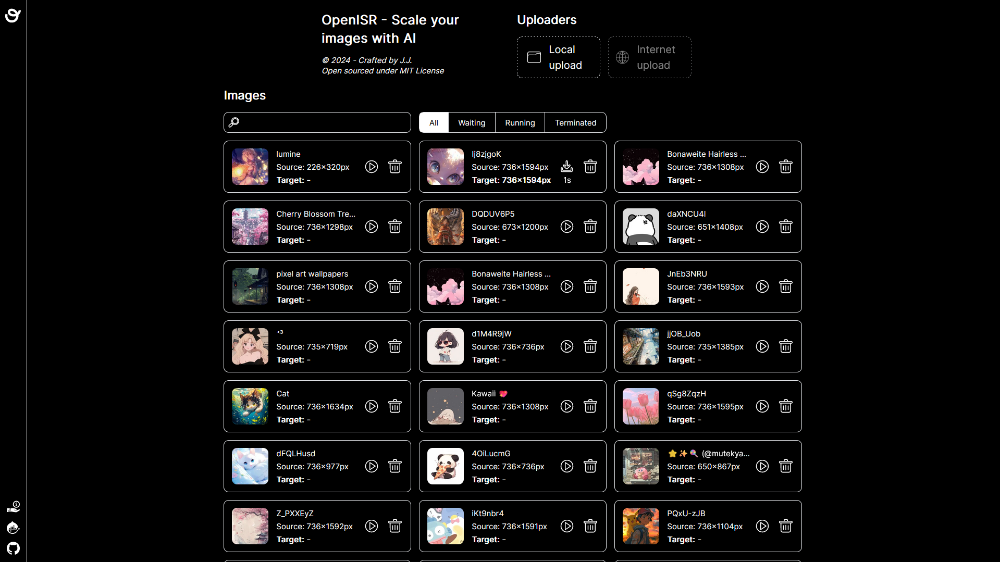
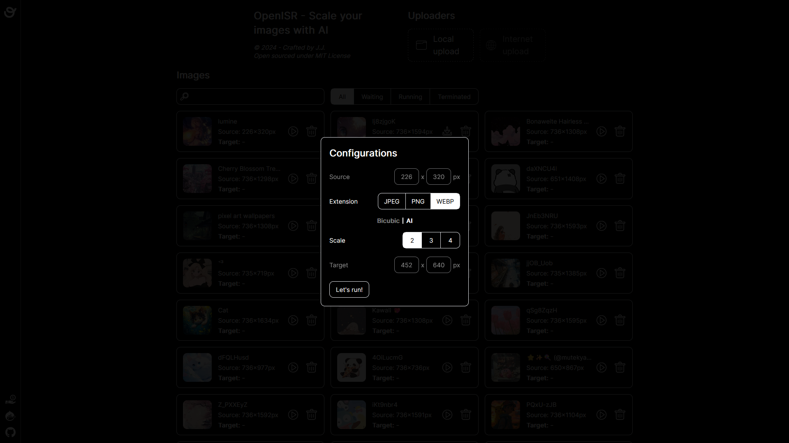

<p align="center">
  <a href="https://github.com/lovindata/openisr" target="_blank">
    
  </a>
</p>

<p align="center">
  OpenISR - Scale your images with AI
</p>

<p align="center">
    <a href="https://github.com/lovindata/openisr/blob/main/LICENSE">
      
    </a>
</p>

---

## Installation

For Docker:

```bash
docker pull lovindata/openisr:latest
```

_Note: The image supports Windows, Linux, and MacOS, specifically amd64 and arm64._

## Get started

For Docker:

```bash
docker run -p 8000:8000 lovindata/openisr:latest
```

For Docker Compose:

```yml
version: "3.8"
services:
  openisr:
    image: lovindata/openisr:latest
    ports:
      - "8000:8000"
```

Then go to http://localhost:8000.

## Looks

You can list, upload, and delete images from the main page.

<p align="center">
  
  <sub>OpenISR - Images</sub>
</p>

You can process your images and download them afterward.

<p align="center">
  
  <sub>OpenISR - Process</sub>
</p>

## Advanced

Environment variables:

| Variable                           | Default | Description                                     |
| ---------------------------------- | :-----: | ----------------------------------------------- |
| OPENISR_PROD_MODE                  |  True   | Set at docker level, must never be overwritten. |
| OPENISR_API_PORT                   |  8000   | Application port.                               |
| OPENISR_PROCESS_TIMEOUT_IN_SECONDS |   60    | Image maximum processing time in seconds.       |

Data:

The persistent data is located at: `/app/backend/data/openisr.db`.

Example:

```yml
version: "3.8"
services:
  openisr-advanced:
    image: lovindata/openisr:latest
    ports:
      - "5000:5000"
    environment:
      - OPENISR_API_PORT=5000
      - OPENISR_PROCESS_TIMEOUT_IN_SECONDS=30
    volumes:
      - ./data:/app/backend/data
```

## Contribution

This repository includes UI/UX design, Frontend, Backend, and DevOps components. Please check each README.md file for more details.

- [Design](https://github.com/lovindata/openisr/tree/main/design)
- [Frontend](https://github.com/lovindata/openisr/tree/main/frontend)
- [Backend](https://github.com/lovindata/openisr/tree/main/backend)
- [DevOps](https://github.com/lovindata/openisr/tree/main/devops)
