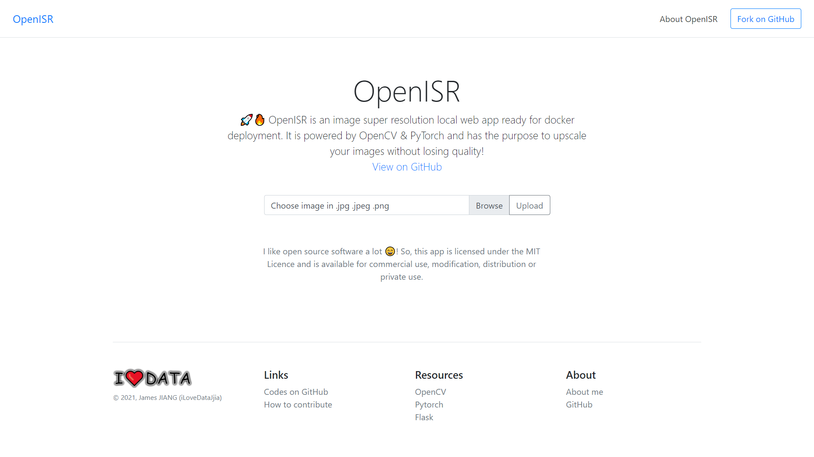

# OpenISR (Work still in progress...)

🚀🔥 OpenISR is an image super resolution local web app ready for docker deployment. It is powered by OpenCV & PyTorch and has the purpose to upscale your images without losing quality!

# Some results

How the application looks like at the moment.

Some results below on different kind of images.

Input | Forced Enlargement | OpenISR Enlargement
:-:|:-:|:-:
 |  | 

Input | Forced Enlargement | OpenISR Enlargement
:-:|:-:|:-:
 |  | 

Input | Forced Enlargement | OpenISR Enlargement
:-:|:-:|:-:
 |  | 

# Want to run or modify the application yourself ?

- Comming soon! 😣

# References

The links used to understand the theory and implementation.

**EDSR**
- [Enhanced Deep Residual Networks for Single Image Super-Resolution](https://arxiv.org/pdf/1707.02921.pdf)
- [Single image super-resolution with deep neural networks](https://krasserm.github.io/2019/09/04/super-resolution/)
- [Super Resolution, Going from 3x to 8x Resolution in OpenCV](https://bleedai.com/super-resolution-going-from-3x-to-8x-resolution-in-opencv/)

**nESRGAN+**
- [Photo-Realistic Single Image Super-Resolution Using a Generative Adversarial Network](https://arxiv.org/pdf/1609.04802.pdf)
- [SRGAN Paper Explained](https://medium.com/@ramyahrgowda/srgan-paper-explained-3d2d575d09ff#:~:text=SRGAN%20which%20is%20a%20GAN,to%20changes%20in%20pixel%20space.)
- [Super Resolution GAN (SRGAN)](https://www.geeksforgeeks.org/super-resolution-gan-srgan/)
- [ESRGAN: Enhanced Super-Resolution Generative Adversarial Networks](https://arxiv.org/pdf/1809.00219.pdf)
- [ESRGAN+ : FURTHER IMPROVING ENHANCED SUPER-RESOLUTION GENERATIVE ADVERSARIAL NETWORK](https://arxiv.org/pdf/2001.08073.pdf)

**CNN Layers**
- [Deep Residual Learning for Image Recognition](https://arxiv.org/pdf/1512.03385v1.pdf)
- [Conv2d: Finally Understand What Happens in the Forward Pass](https://towardsdatascience.com/conv2d-to-finally-understand-what-happens-in-the-forward-pass-1bbaafb0b148)
- [Keras Conv2D and Convolutional Layers](https://www.pyimagesearch.com/2018/12/31/keras-conv2d-and-convolutional-layers/)
- [Pixel Shuffle Layer](https://nico-curti.github.io/NumPyNet/NumPyNet/layers/pixelshuffle_layer.html#:~:text=Pixel%20Shuffle%20layer%20is%20one,a%20single%20low%2Dresolution%20one.)
- [Understanding 2D Dilated Convolution Operation with Examples in Numpy and Tensorflow with Interactive Code](https://towardsdatascience.com/understanding-2d-dilated-convolution-operation-with-examples-in-numpy-and-tensorflow-with-d376b3972b25)

# Other References

**Installation**
- [Build and Install OpenCV With CUDA (GPU) Support on Windows 10](https://haroonshakeel.medium.com/build-opencv-4-4-0-with-cuda-gpu-support-on-windows-10-without-tears-aa85d470bcd0)
- [How to Fix ModuleNotFoundError and ImportError](https://towardsdatascience.com/how-to-fix-modulenotfounderror-and-importerror-248ce5b69b1c)

**Ops**
- [How to change the location of docker images & containers when using Docker Desktop on WSL2 with Windows 10 Home?](https://stackoverflow.com/questions/62441307/how-can-i-change-the-location-of-docker-images-when-using-docker-desktop-on-wsl2)

**Docstring & Project structure**
- [The Sphinx docstring format](https://sphinx-rtd-tutorial.readthedocs.io/en/latest/docstrings.html)
- [Python Application Layouts: A Reference](https://realpython.com/python-application-layouts/)

**FastAPI**
- [Request Files - FastAPI](https://fastapi.tiangolo.com/tutorial/request-files/)
- [How to Save Uploaded Files in FastAPI](https://levelup.gitconnected.com/how-to-save-uploaded-files-in-fastapi-90786851f1d3)
- [[QUESTION] Is this the correct way to save an uploaded file](https://github.com/tiangolo/fastapi/issues/426)
- [Templates](https://fastapi.tiangolo.com/advanced/templates/)